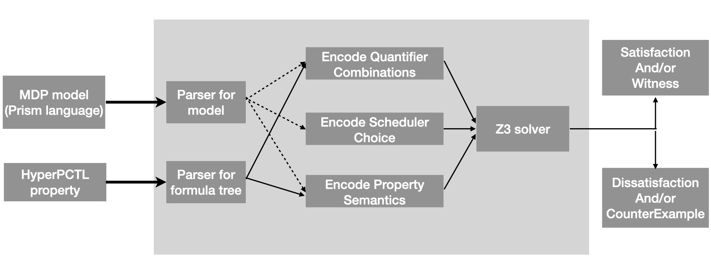

[HyperPROB](https://github.com/oyendrila-dobe/HyperProb "HyperProb") is a tool that can verify if a given hyperproperty is true for an input Markov Decision Process. Here we explain the working of [HyperPROB](https://github.com/oyendrila-dobe/HyperProb "HyperProb"), usage of the tool and how to interpret its output.  

The tool essentially takes two inputs:
1. A *Markov Decision Process* (MDP).
2. A *hyperproperty* described in HyperPCTL.

 Figure: Overview of HyperProb 

 

The main idea is that we encode the scheduler, quantifier, semantic, and transitional data from the model and the property as [z3](https://github.com/Z3Prover/z3 "z3") constraints. On solving, z3 either returns sat or unsat which we further use to provide insight to the user about the satisfaction or unsatisfaction.

We have divided this site into sections for more detailed explaination:
- How to specify model? -> [model tab](model/ "model tab")
- How to specify the hyperproperty? -> [property tab](hyperproperty/ "hyperproperty tab")
- How to use the tool? -> [tool usage tab](tool_usage/ "tool_usage tab")
- How to use the tool quickly? -> [docker tab](docker/ "docker tab")

People
-------

  Authors:
  - Oyendrila Dobe, Michigan State University. 
  - [Borzoo Bonakdarpour](http://www.cse.msu.edu/~borzoo/), Michigan State University. 
  
  Other Contributors:
  - [Erika Abraham](https://ths.rwth-aachen.de/people/erika-abraham/), RWTH Aachen.
  - [Ezio Bartocci](https://informatics.tuwien.ac.at/people/ezio-bartocci), TU-Vienna.

  Acknowledgements:
  - United States National Science Foundation 
  - We would like to thank [Mattias Volk](https://moves.rwth-aachen.de/people/volk/) and [Sebastian Junges](https://sjunges.github.io/sebastian-junges/) for their help with Stormpy during the tool development.